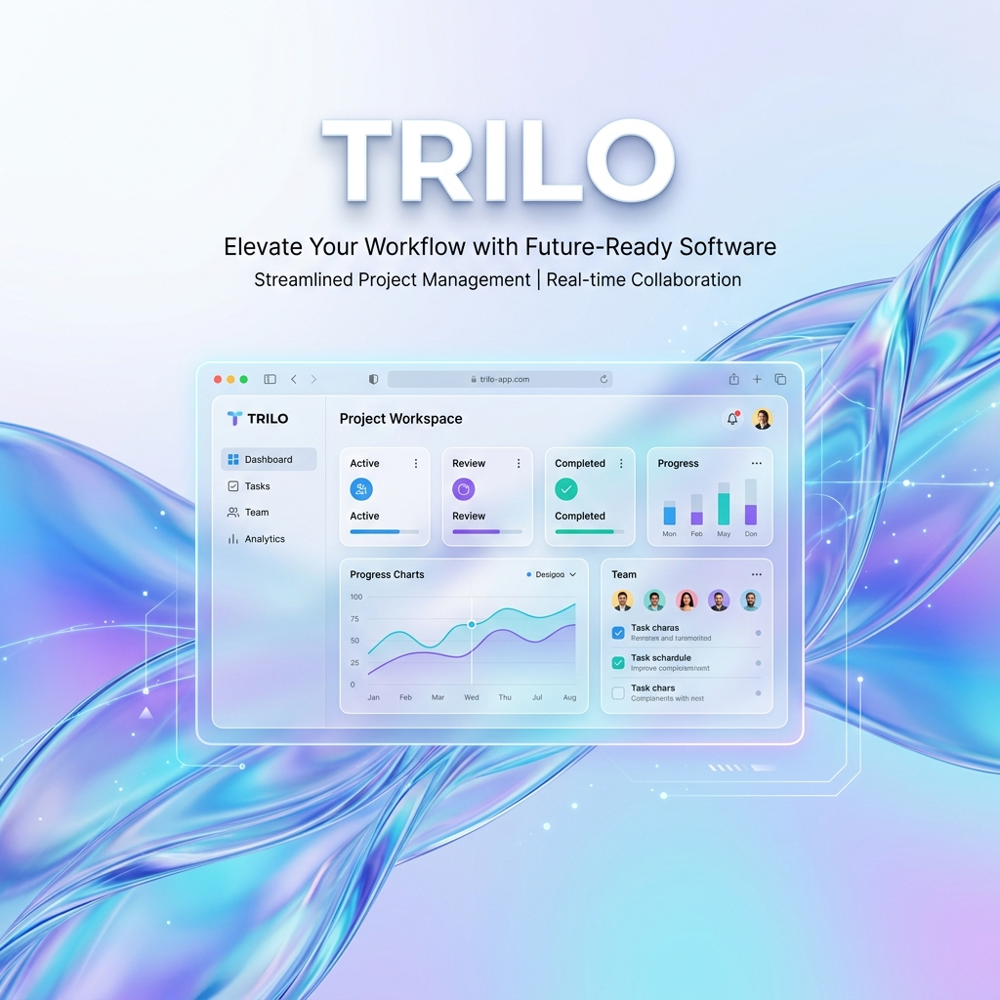

<div align="center">
  
  
  # 🌊 Trilo
  ### The Liquid Glass Desktop Experience
  
  [](https://opensource.org/licenses/MIT)
  [](https://tauri.app/)
  [](https://nextjs.org/)
  [](#-early-development-notice)

  **Trilo** is a next-generation desktop environment built for speed, aesthetics, and power. Inspired by the "Liquid Glass" design language, it blends high-performance Rust internals with a fluid React frontend to redefine your workspace.
</div>

---

### ⚠️ Early Development Notice
> [!IMPORTANT]
> Trilo is currently in **early alpha**. Expect bugs, frequent breaking changes, and experimental features. We are actively refining the core architecture and appreciate any feedback or issue reports.

---

## ✨ Key Features

- **🪟 Advanced Window Management**: Native-level control with a premium glassmorphism aesthetic and smooth transitions.
- **🔌 Native App Embedding**: Revolutionary window reparenting technology to host external applications directly within the Trilo container.
- **⚡ High Performance**: Built on **Tauri 2.0**, offering a lightweight footprint and blazing fast execution compared to traditional frameworks.
- **🎨 Liquid Glass UI**: A curated design system using **NextUI**, **Framer Motion**, and **Tailwind CSS 4** for a state-of-the-art visual experience.
- **🛠️ System Intelligence**: Integrated system controls (Volume, Brightness, Power) powered by native Win32/Rust bindings.
- **⌨️ Command Palette**: A unified interface for lightning-fast access to tools, settings, and application launching.

## 🚀 Tech Stack

| Component | Technology |
| :--- | :--- |
| **Frontend** | [Next.js 16](https://nextjs.org/) (App Router) |
| **Core Runtime** | [Tauri 2.0](https://tauri.app/) |
| **Styling** | [Tailwind CSS 4](https://tailwindcss.com/) & [NextUI](https://nextui.org/) |
| **Animations** | [Framer Motion](https://www.framer.com/motion/) |
| **Backend** | [Rust](https://www.rust-lang.org/) (Window Management & OS API) |
| **Scripting** | [Python](https://www.python.org/) (Specialized bridges) |
| **Icons** | [Lucide React](https://lucide.dev/) |

## 🛠️ Getting Started

### Prerequisites

Ensure you have the following installed:
- [Node.js](https://nodejs.org/) (Latest LTS)
- [pnpm](https://pnpm.io/)
- [Rust & Cargo](https://www.rust-lang.org/tools/install)
- [Python 3.10+](https://www.python.org/)

### Installation

1. **Clone the repository**:
   ```bash
   git clone https://github.com/IAG-Software/Trilo.git
   cd Trilo
   ```

2. **Install dependencies**:
   ```bash
   pnpm install
   ```

3. **Run in development mode**:
   ```bash
   pnpm tauri dev
   ```

## 🏗️ Architecture

Trilo utilizes a unique hybrid architecture to bridge web flexibility with native performance:
- **Tauri Core**: Handles the main window lifecycle, security, and low-level system bindings.
- **Rust Backend**: Implements the heavy lifting for window reparenting and Win32 API interactions.
- **Next.js Frontend**: Provides a highly responsive, modern UI layer with server-side rendering benefits.
- **Python Bridge**: Used for specific system-level scripts and background enforcers.

## 🤝 Contributing

We welcome contributions of all kinds! Whether it's reporting a bug, suggesting a feature, or submitting a pull request, your help is appreciated.

1. Fork the Project
2. Create your Feature Branch (`git checkout -b feature/AmazingFeature`)
3. Commit your Changes (`git commit -m 'Add some AmazingFeature'`)
4. Push to the Branch (`git checkout -b feature/AmazingFeature`)
5. Open a Pull Request

## 📜 License

Distributed under the MIT License. See `LICENSE` for more information.

---

<div align="center">
  Built with ❤️ by the <b>IAG Software</b> Team
</div>
